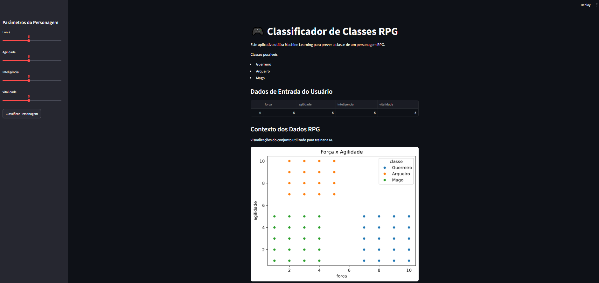

# RPG Machine Learning


_Preview da interface do classificador de personagens RPG._

Projeto desenvolvido para a disciplina de **Inteligência Artificial** do curso de **Engenharia de Software**, com foco na aplicação de conceitos de **Machine Learning**, treinamento de modelos supervisionados e desenvolvimento de interfaces interativas com Streamlit.

## Tecnologias Utilizadas

- **Python**
- **Pandas**
- **Scikit-Learn**
- **Streamlit**
- **Matplotlib**
- **Seaborn**
- **Joblib**

## Objetivo do Projeto

O objetivo deste projeto é desenvolver um sistema capaz de **classificar personagens RPG** com base em seus atributos, utilizando técnicas de aprendizado de máquina.

A aplicação permite que o usuário informe características como força, agilidade, inteligência e vitalidade para que o modelo treinado realize a previsão da classe mais provável entre:

- Guerreiro
- Arqueiro
- Mago

Além da classificação, o sistema apresenta as probabilidades associadas a cada classe e visualizações do conjunto de dados utilizado durante o treinamento.

### Arquivos principais

- **gerar_dataset.py** → Gera o conjunto de dados sintético dos personagens.
- **train_model.py** → Realiza o treinamento do modelo de Machine Learning.
- **app.py** → Interface web desenvolvida com Streamlit.
- **requirements.txt** → Dependências necessárias para execução do projeto.

## Como executar o projeto

### 1. Clone o repositório

```bash
git clone https://github.com/muddyorc/rpg-machine-learning.git
```

### 2. Acesse a pasta do projeto

```bash
cd rpg-machine-learning
```

### 3. Crie um ambiente virtual

```bash
python -m venv venv
```

### 4. Ative o ambiente virtual

Windows:

```bash
venv\Scripts\activate
```

Linux/MacOS:

```bash
source venv/bin/activate
```

### 5. Instale as dependências

```bash
pip install -r requirements.txt
```

### 6. Gere o dataset

```bash
python gerar_dataset.py
```

### 7. Treine o modelo

```bash
python train_model.py
```

### 8. Execute a aplicação

```bash
streamlit run app.py
```

## Resultados

O modelo é treinado utilizando regressão logística e avaliado por meio de métricas de classificação.

Após o treinamento, são gerados automaticamente os arquivos:

```text
rpg_classifier.pkl
model_features.pkl
model_classes.pkl
```

Esses arquivos são utilizados pela aplicação Streamlit para realizar as previsões em tempo real.
